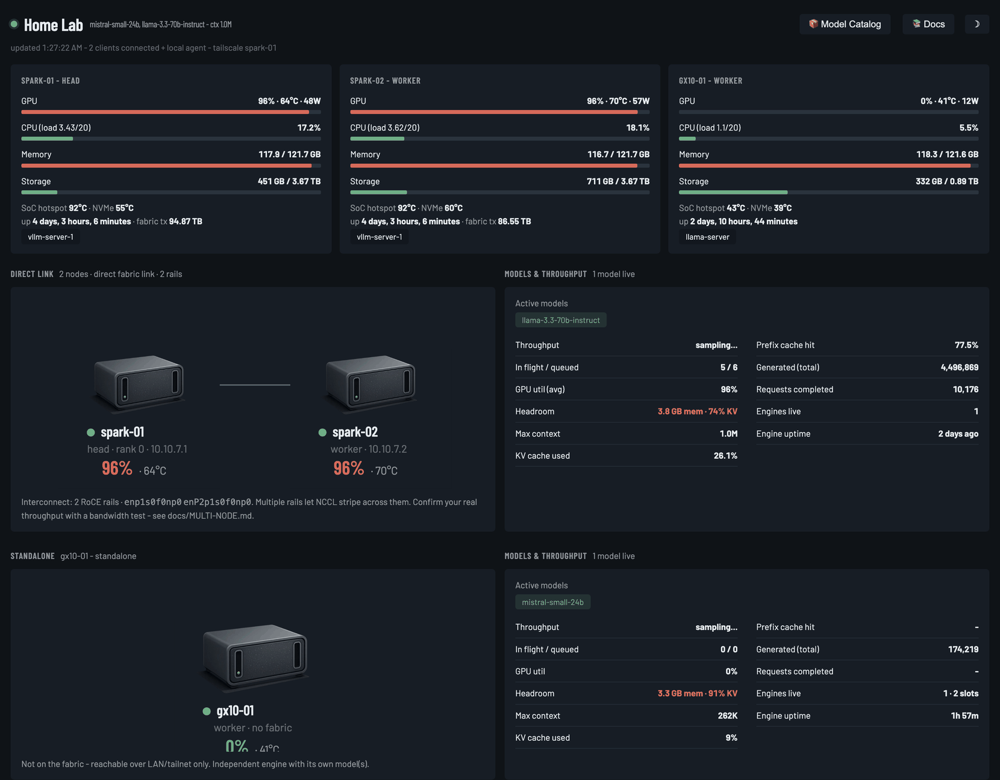
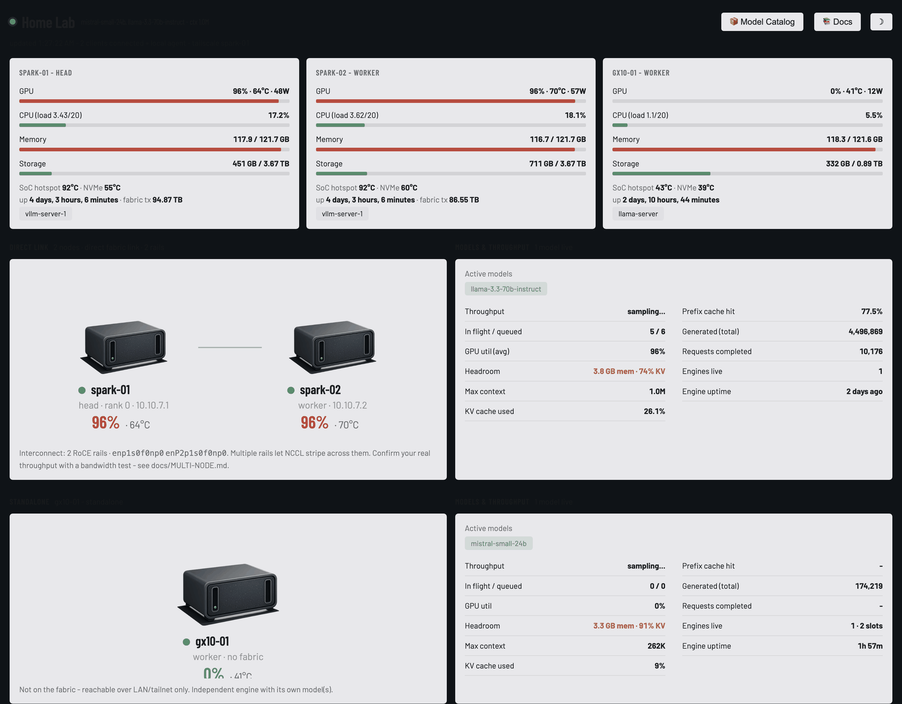
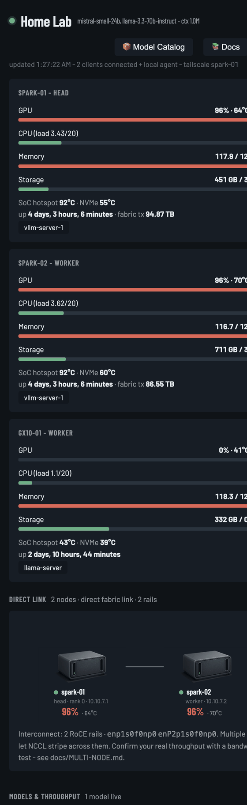

# Spark Monitor

**A live dashboard for your NVIDIA DGX Spark — one Python file, zero dependencies.**

Spark Monitor answers the questions you actually have about a Spark sitting on your
desk: is the model up, is the GPU busy, how hot is it, how much has it cost me this
month, and when was it last used? It runs on the Spark itself and you open it from
your laptop or phone.

It scales from one Spark to a cabled cluster of them. Adding a node is one line of
config — every card, chart and diagram follows automatically.



```bash
git clone https://github.com/ThinkCode/spark-monitor.git
cd spark-monitor
python3 spark-monitor.py
```

That's it. No `pip install`, no Node, no Docker, no build step, no database.
Open `http://<your-spark>:8088`.

→ **New here? Start with [the 10-minute quickstart](docs/QUICKSTART.md).**

---

## What you get

| | |
|---|---|
| **Per-node health** | GPU utilization, temperature and power, CPU load, unified memory, storage, uptime, running containers |
| **Model & throughput** | What's serving right now, tokens/sec, requests in flight and queued, KV-cache pressure, prefix-cache hit rate, memory headroom |
| **Topology** | An auto-drawn diagram of how your nodes are actually cabled, from live interface data |
| **Trends** | Throughput, GPU, memory and KV cache over 24 h / 7 d / 30 d, plus a day×hour heatmap of when your cluster is busy |
| **Usage sessions** | When the cluster was genuinely working, for how long, and how many tokens came out |
| **Thermals & placement** | GPU, SoC-hotspot and NVMe temperatures, with a warning when one node runs hotter than another — which is usually airflow, not a fault |
| **Power & cost** | Estimated kWh and cost per day/month/year, per node, at your electricity rate |
| **Alarms** | A banner when something needs you: node offline, thermal limit, storage nearly full, memory near OOM, requests piling up |
| **Docs drawer** | This documentation, readable inside the dashboard — including on your phone |
| **Installable** | Add it to your iPhone or Android home screen and it behaves like an app |

### Trends, thermals and cost

Below the live cards, the same data over time — throughput split into generated and
prompt tokens, when the cluster was actually working, how hot each node runs, and what
it costs you.


### Light theme, and your phone

Both themes come from one set of CSS variables, and the layout reflows to one column on a
phone — where it installs to your home screen and behaves like an app.





## Design principles

These are the reasons the tool is shaped the way it is. If you send a pull request,
these are what it will be measured against.

**One file, standard library only.** `spark-monitor.py` has no dependencies at all —
not one. Nothing to install, nothing to keep updated, nothing that breaks when a
package publishes a new major version. You can read the whole thing.

**Poll-on-access.** Live metrics are gathered only when a browser asks for them, with
a 3-second cache to absorb bursts. A dashboard nobody is looking at costs your cluster
literally nothing. The single exception is a 60-second sampler that records the history
trends are built from — a few milliseconds of work, ~50 bytes per sample.

**No agents on your nodes.** Worker metrics come over plain SSH using the keys you
already have. There is nothing to install on the other machines.

**Read-only, with one exception.** The only endpoint that writes anything is the power
cost settings form, which accepts four validated and clamped numbers. The dashboard
cannot restart your engine, shut down a node, or change your cluster in any way.

**Say when a number is an estimate.** The DGX Spark has no wall-power sensor, so the
cost figures are modelled, and the UI says so wherever it shows one. See
[METRICS.md](docs/METRICS.md).

## Requirements

- **A DGX Spark** (or another GB10 machine — ASUS Ascent GX10 and similar all work),
  running its stock Linux with `nvidia-smi` available.
- **Python 3.8 or newer**, which DGX OS already has.
- **For extra nodes:** passwordless SSH from the machine running the dashboard to
  each other node. See [MULTI-NODE.md](docs/MULTI-NODE.md).
- **For access away from home:** Tailscale, which is free for personal use. See
  [TAILSCALE.md](docs/TAILSCALE.md).

Spark Monitor does not care which inference engine you run. vLLM, llama.cpp, SGLang
and anything else exposing an OpenAI-compatible `/v1/models` endpoint with Prometheus
metrics will be picked up.

## Documentation

| Guide | Read it when |
|---|---|
| [Quickstart](docs/QUICKSTART.md) | You have a Spark and want the dashboard running in 10 minutes |
| [Installation](docs/INSTALL.md) | You want it running as a service that survives reboots |
| [Configuration](docs/CONFIGURATION.md) | You want to know what every setting does |
| [Multiple nodes](docs/MULTI-NODE.md) | You have more than one Spark |
| [Remote access](docs/TAILSCALE.md) | You want it on your phone, from anywhere |
| [Understanding the metrics](docs/METRICS.md) | A number looks alarming and you want to know if it is |
| [JSON API](docs/API.md) | You want to build something on top of it |
| [Troubleshooting](docs/TROUBLESHOOTING.md) | Something is blank, unreachable or wrong |
| [Architecture](docs/ARCHITECTURE.md) | You want to change the code |

## Security

**Spark Monitor has no authentication.** It is built to run on a trusted network —
your home LAN, or a private Tailscale tailnet — and it is safe there.

**Never port-forward its port on your router.** It exposes no controls, but it does
reveal your hardware, model names, connected client IP addresses and usage patterns.
[Tailscale](docs/TAILSCALE.md) is the right way to reach it from outside, and it is
easier than port forwarding anyway.

Full detail and the threat model: [SECURITY.md](SECURITY.md).

## Contributing

Bug reports, node compatibility reports ("works on my GX10") and pull requests are
all welcome. Please read [CONTRIBUTING.md](CONTRIBUTING.md) first — especially the
zero-dependency rule, which is not negotiable.

## Credits

The N-node registry idea and the graceful per-node degradation pattern were adapted
from [sparkDash](https://github.com/MiaAI-Lab/sparkDash) (MIT), a React/Node
multi-Spark monitor worth looking at if you would rather have a push-based stack.

Typeface: [Barlow](https://github.com/jpt/barlow) by Jeremy Tribby, SIL Open Font
License 1.1 (see [assets/OFL.txt](assets/OFL.txt)).

Node artwork (`assets/ai-node-v2.webp`) is original to this project and covered by the
same MIT license. It is a generic compute-node illustration — not NVIDIA product
imagery, and it carries no NVIDIA branding.

## License

[MIT](LICENSE).

Not affiliated with or endorsed by NVIDIA. "DGX Spark" and "NVIDIA" are trademarks of
NVIDIA Corporation, used here only to say what hardware this tool runs on.
