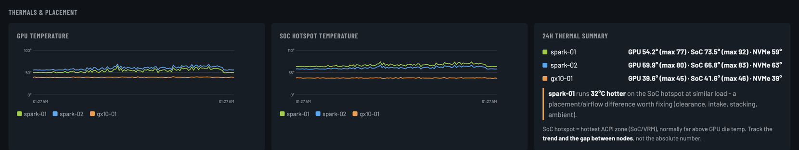
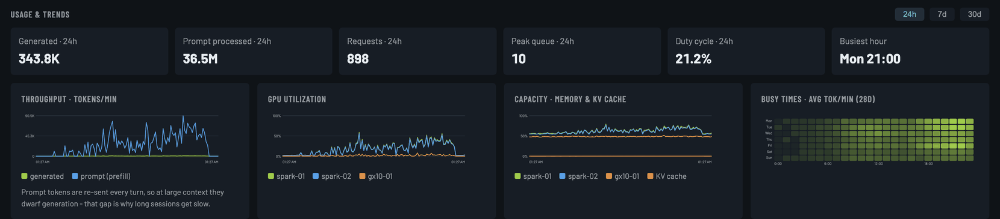
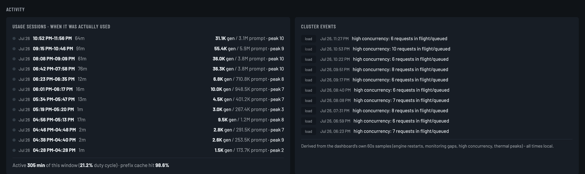
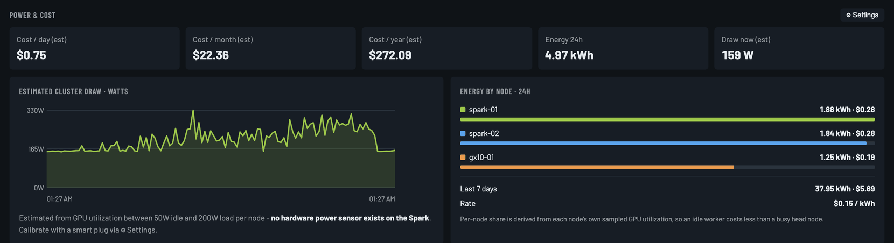

# Understanding the metrics

Read this before worrying about a number. Several readings on this hardware look
alarming and are completely normal, and one of the most important numbers on the page is
an estimate.

---

## Temperatures



### GPU temperature

The GPU die. This is the straightforward one. Under sustained load, 60–80 °C is normal.
Spark Monitor warns at 84 °C and flags it critical at 87 °C.

### SoC hotspot — the scary-looking one

**This will read far higher than your GPU temperature, and that is by design.**

It's the hottest of the ACPI thermal zones, which on GB10 hardware sits on the SoC/VRM
rather than the GPU die. Readings in the 80s and 90s °C are routine. It is not package
temperature, and it is not directly comparable to the GPU number.

**What to actually watch:**

1. **The trend.** A high but stable number is fine; one climbing steadily for hours at constant load is not.
2. **The gap between nodes.** This is the useful signal — two identical machines under identical load should read within a few degrees of each other.

Spark Monitor computes that gap for you and raises an amber hint when nodes differ by
≥8 °C, turning green when they're balanced. A real example from a two-node cluster: at
95% vs 94% GPU load, one node's SoC hotspot ran **13 °C hotter** than the other — while
its *GPU* was actually 9 °C *cooler*.

That asymmetry isn't a thermal fault, it's **airflow**. Check clearance around the
chassis, whether the units are stacked, whether an intake is against a wall or blocked
by cables, and local ambient temperature. Because the dashboard tracks it continuously,
you can move a machine and see the result within the hour — which turns a guess into a
measurement.

### NVMe temperature

The SSD controller. 40–60 °C is normal; the dashboard warns at 80 °C. Sustained high
readings shorten drive life and cause thermal throttling, which looks like unexplained
I/O slowness.

---

## Models & throughput

### Throughput (tok/s)

Live generation rate, computed from the difference in the engine's cumulative token
counter between polls. It's a rate right now, not an average — it reads 0 when nothing is
generating.

Says `sampling…` until two polls have happened, since a rate needs two points.

### In flight / queued

**The most honest measure of whether your cluster is being used.** Straight from the
engine's own counters, so it catches every request on every path — including users who
never appear as a network client because something on the box is proxying for them.

Queued consistently above zero means you're capacity-limited: requests are waiting for a
slot. A few queued during a burst is fine.

### KV cache used

How full the attention cache is. This is the resource that limits how many long
conversations you can run at once. Near 100% means new requests will queue or get
evicted, regardless of how idle the GPU looks.

### Prefix cache hit rate

The fraction of prompt tokens served from cache instead of being recomputed. Read the
next section to understand why this matters so much.

### Generated vs prompt tokens — read this one

The throughput chart plots these as **two separate lines**, and the difference between
them is usually shocking. Measured on a real cluster over 24 hours: **255 M prompt
tokens vs 2.2 M generated — a 115× ratio.**

Here's why. In a multi-turn conversation the entire history is re-sent with every single
turn. At a large context size, prefill utterly dominates your workload; generation is
almost a rounding error.

Two consequences worth acting on:

1. **Reducing your context size is worth more than any other tuning.** If you serve
   256 K context when your work needs 32 K, you're paying for prefill you never use.
2. **Prefix caching is what makes large contexts survivable at all.** On that same
   cluster the hit rate was 99.3% — without it, the workload would have been impossible.
   If your prefix hit rate is low, find out why before buying more hardware.

This is exactly why the two are charted separately. Summing them, which is the obvious
thing to do, produces impressive-looking totals that tell you nothing.

### Headroom

The tighter of two limits: free unified memory (minimum across nodes) and free KV cache.
Green above 8 GB, amber below, red below 3 GB. On unified-memory hardware, memory is
shared between CPU and GPU, so this is the number that predicts an OOM.

---

## Usage & trends



### Usage sessions



Contiguous stretches of real activity, derived from the dashboard's own 60-second
samples — a session starts when tokens flow or a request is running, and ends after ~4
idle minutes. Gaps shorter than that are bridged, so one conversation with thinking pauses
reads as one session rather than forty.

Each row shows when, for how long, generated and prompt tokens, and peak concurrency. A
green dot means it's still going.

This is derived from counters rather than logs on purpose. Log scraping was tried and
abandoned: engines don't log per-request lines unless you enable it, the format differs
between engines and versions, and most log in UTC while the rest of the UI is local —
which made a quiet night look like an outage.

### Duty cycle

The fraction of the window in which the cluster did any work. Useful for a reality check
on utilisation: hardware that's busy 3% of the time is telling you something about
whether the next purchase is justified.

### Busy times heatmap

Average tokens/minute by day of week and hour, over 28 days. Good for finding a safe
window for maintenance or model swaps.

### Cluster events

Derived from the same history, not from logs:

| Event | What it means |
|---|---|
| **restart** | A cumulative counter went backwards, so the engine restarted. Expected if you restarted it; worth investigating if you didn't. |
| **gap** | No samples for several intervals — the dashboard or its host was down. |
| **load** | 5+ requests in flight or queued. |
| **therm** | SoC hotspot reached 98 °C. |

All timestamps render in your browser's local time.

---

## Power & cost



### These numbers are estimates. Here's exactly why.

**The DGX Spark exposes no system power sensor.** Verified on this hardware: no INA or
PMBus monitor, no `/sys/class/power_supply`, no hwmon power rail, and `nvidia-smi`
reports `power.limit: N/A` with a `power.draw` around 33 W that is **GPU-domain only,
not wall power**.

So a measured cost figure is not possible. Rather than showing a fake precise number or
nothing at all, Spark Monitor models it:

```
watts(node) = idle_w + (load_w - idle_w) × gpu_util / 100
```

Energy is integrated over the 60-second samples into kWh, then multiplied by your rate.
Per-node figures use each node's own utilization, so an idle worker correctly costs less
than a busy head node.

The defaults — 50 W idle, 200 W load — are reasonable for a Spark (it ships with a 240 W
adapter), but they are guesses about your specific machine.

### Calibrating it (10 minutes, makes it real)

1. Put one Spark on a smart plug or power meter that reads watts.
2. Read the wall draw with the machine **idle** — nothing serving, a few minutes settled.
3. Load it hard — a sustained inference run pinning the GPU near 100% — and read it again.
4. Enter both in **⚙ Settings**, along with your actual price per kWh and currency.

Settings are stored server-side, so every device you open the dashboard on agrees.

A partial first day is extrapolated to a full-day rate and labelled as such, so your
first day's "cost/month" isn't nonsense.

### What isn't included

Only the nodes in your config. Networking gear, storage, and cooling are not counted, so
treat the figure as the cluster's own draw rather than the total cost of the room.

---

## Clients

### Direct clients

Distinct external peers holding an established TCP connection to a serving port. Your
laptop and your phone show up here. Cluster-internal traffic doesn't: loopback,
link-local, container bridges, the fabric, and the nodes' own addresses are all excluded.

A workstation on the same LAN **is** counted — it's a real client.

### "local agent active"

Loopback or container-bridge connections, meaning something running on the box is talking
to the engine. If that something is a bot or an agent serving other people, **those end
users are invisible at the network layer** — they never hold a connection to your engine,
so this flag is the only hint they exist.

### Why in-flight/queued matters more than either

A TCP connection only exists *during* a request. Between requests an active user has no
connection at all, so a client count of zero doesn't mean nobody is using it. The
engine's own in-flight and queued counters are the ground truth; the client list just
tells you where traffic is arriving from.

---

## Alarms

The banner appears only when something needs you:

| Level | Condition |
|---|---|
| critical | Node offline · GPU ≥ 87 °C · SoC ≥ 98 °C · storage ≥ 95% · under 0.5 GB memory free · model down |
| warning | GPU ≥ 84 °C · SoC ≥ 95 °C · NVMe ≥ 80 °C · storage ≥ 88% · under 1.5 GB free · KV cache ≥ 97% · 8+ requests queued |

There is no alarm history and no notifications — this reflects current state only. If you
want alerting, poll [`/api/stats`](API.md) from something built for it.
