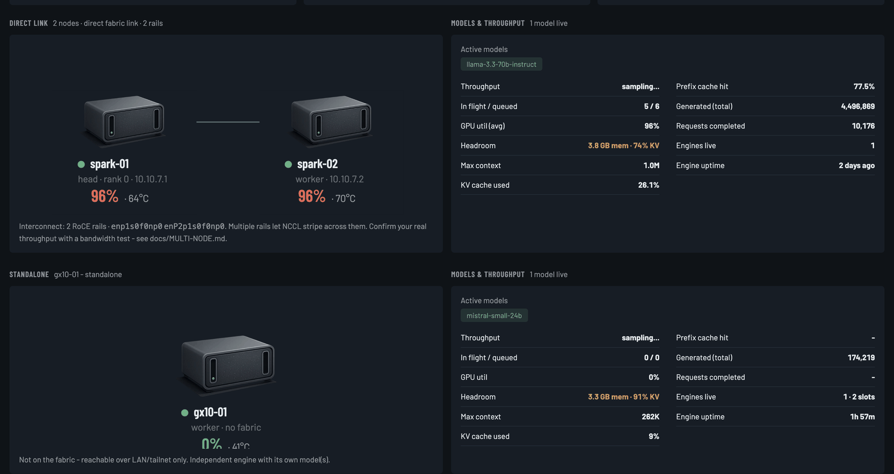

# Adding more nodes

Spark Monitor treats one node and six nodes identically. There is no per-node code, no
agent to install, and no plugin — you add an entry to a list and everything in the UI
follows.

Two things to set up: **SSH access**, then **the config entry**.

---

## How it collects remote metrics

The dashboard runs on one node — the **head** — and reaches the others over plain SSH,
running small read-only commands (`nvidia-smi`, `cat /proc/loadavg`, `free`, some
`sysfs` reads) and parsing the output.

That means:

- **Nothing to install on the other nodes.** No agent, no daemon, no open port.
- **You need passwordless SSH** from the head node to each other node.
- Nodes are polled **in parallel**, and an unreachable one is marked offline rather than
  breaking the poll. A node that's turned off costs you one card saying "unreachable".

## Step 1 — Passwordless SSH from the head node

Do this **on the head node** — the one running the dashboard.

If you don't have a key yet:

```bash
ssh-keygen -t ed25519 -C "spark-monitor"
```

Press Enter at every prompt. **Leave the passphrase empty** — a background service
cannot type one. This key only ever grants access between your own machines.

Copy it to each other node:

```bash
ssh-copy-id you@10.0.0.12
```

You'll be asked for that node's password once. Then verify — this is the test that
matters:

```bash
ssh -o BatchMode=yes 10.0.0.12 nvidia-smi --query-gpu=utilization.gpu --format=csv,noheader
```

It should print a number immediately, with no prompt. `BatchMode=yes` is what Spark
Monitor uses, so if this hangs or asks for anything, the dashboard will report that node
as unreachable.

If the username differs between machines, either use `ssh_user` in the config or add a
`~/.ssh/config` entry:

```
Host 10.0.0.12
  User adifferentname
  IdentityFile ~/.ssh/id_ed25519
```

## Step 2 — Add it to the config

Edit `~/.config/spark-monitor/config.json`:

```json
{
  "nodes": [
    { "id": "n1", "name": "spark-1", "role": "head",   "host": null },
    { "id": "n2", "name": "spark-2", "role": "worker", "host": "10.0.0.12" }
  ]
}
```

`host: null` marks the machine running the dashboard. Every other node gets the address
you just tested with.

Use **fixed addresses**. A DHCP lease that moves turns into a node that mysteriously
goes offline. Either reserve the address on your router or use a hostname that resolves
reliably — a [Tailscale](TAILSCALE.md) address is ideal, since it never changes.

Then:

```bash
systemctl --user restart spark-monitor
python3 spark-monitor.py --check
```

`--check` probes each node and tells you exactly which one failed and why:

```
  [ ok ] spark-1   local       gpu 4%  mem 22.1%  rails: 10.10.7.1  serving: [8000]
  [ ok ] spark-2   10.0.0.12   gpu 0%  mem 18.9%  rails: 10.10.7.2  serving: []
```

## Step 3 — Nothing

That's the whole process. The new node now has its own card, its own line on every
chart, its own thermal series, its own share of the energy breakdown, and a box in the
topology diagram.

---

## The topology diagram



The diagram is drawn from **live cabling**, not from your config. On every poll each
node reports which of its interfaces are backed by an RoCE/InfiniBand device and what
addresses they carry. Nodes sharing a fabric subnet are directly linked; each connected
group is drawn according to its shape:

| What's detected | How it's drawn |
|---|---|
| Node with no fabric address | **Standalone** — LAN only, its own independent engine |
| Two nodes sharing a subnet | **Direct link** |
| Three or more, each with exactly two neighbours | **Ring** |
| Three or more, more densely connected | **Mesh** |

Because it's derived rather than declared, **re-cabling shows up on the next poll**. The
diagram can't drift out of date, which is exactly the failure mode of a hand-maintained
one. Nothing to configure: cable the nodes, address the interfaces, and the picture
updates.

Groups matter for metrics too. Each fabric group's model and throughput figures are
gathered only from engines on **its own** nodes, so two independent groups don't have
their numbers summed into one meaningless total.

If your interconnect is plain Ethernet rather than RoCE, set `fabric_prefix` to its
address prefix — see [CONFIGURATION.md](CONFIGURATION.md#fabric_prefix).

## Checking real fabric throughput

The dashboard reports how many bytes have crossed the fabric and how many rails it
found, but it does **not** benchmark the link — a monitor shouldn't generate load.
Measure it yourself:

```bash
# on the receiving node
iperf3 -s

# on the sending node, over the fabric address (not the LAN one)
iperf3 -c 10.10.7.1 -P 4
```

Use the fabric address. Pointing `iperf3` at the LAN address measures your Ethernet and
tells you nothing about the fabric.

If throughput is far below what you expect, check MTU consistency across the link
(jumbo frames want the same MTU on both ends) and that both ends negotiated the speed
you think they did (`ip -d link show <iface>`).

## Which node should run the dashboard?

Whichever is **on most reliably**. Considerations:

- History lives on that node. If it's down, no samples are recorded — you'll see a
  "monitoring gap" event when it returns.
- It needs SSH keys reaching every other node.
- The load is negligible either way: a poll is a handful of short commands, and only
  when someone is looking.

Running it on the busiest inference node is fine. The service is `Nice=10`, so it yields
to your actual work.

## Multiple dashboards

Nothing stops you running Spark Monitor on two nodes, each with its own config, as a
hedge against the head node being down. They don't coordinate and each keeps its own
history — mild duplication, no conflict.

## Removing a node

Delete its entry and restart. Its history stays in `history.jsonl` but is no longer
charted, since chart series come from the current node list. Re-adding it with the
**same `id`** picks the old history back up.
