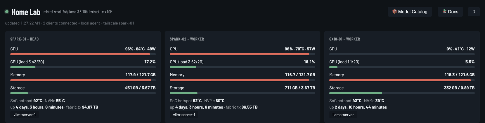

# Quickstart — from nothing to a live dashboard

This is the shortest path. About 10 minutes, one Spark, no prior setup assumed.

If you have several Sparks, do this first on one of them and add the others afterwards
with [MULTI-NODE.md](MULTI-NODE.md). Start small — it's easier to tell what went wrong.

---

## Before you start

You need:

- **A DGX Spark** you can log into, powered on. Any GB10 machine works (ASUS Ascent
  GX10 and the other variants are the same hardware).
- **A terminal on it.** Either sitting at it with a keyboard, or over SSH from your
  laptop. If you have never SSH'd into it, plugging in a monitor and keyboard for these
  few commands is completely fine.
- **Its IP address.** Run `hostname -I | awk '{print $1}'` on the Spark and write down
  what it prints — you will open the dashboard at that address. It will look something
  like `192.168.1.42`.

You do **not** need: Docker, Node.js, a package manager, root access, or a model
already running. The dashboard works before you have set up any inference at all — it
just shows the model as down.

---

## Step 1 — Check Python and the GPU tool

On the Spark:

```bash
python3 --version && nvidia-smi --query-gpu=name --format=csv,noheader
```

You should see a version of 3.8 or higher, and your GPU's name. DGX OS ships both, so
this normally just works.

If `nvidia-smi` is missing, stop here and fix that first — it is how every GPU number
in the dashboard is read. If `python3` is missing, install it with your distribution's
package manager (`sudo apt install python3` on DGX OS and other Ubuntu-based systems).

## Step 2 — Get Spark Monitor

```bash
git clone https://github.com/ThinkCode/spark-monitor.git
cd spark-monitor
```

No `git`? Either `sudo apt install git`, or download the ZIP from the GitHub page and
unpack it.

## Step 3 — Run it

```bash
python3 spark-monitor.py
```

You should see something like:

```
No config found — wrote a starter one at /home/you/.config/spark-monitor/config.json
Spark Monitor 1.0.0 — 1 node(s): spark-1a2b
  http://0.0.0.0:8088
  NOTE: no authentication. Keep this port on your LAN or tailnet — never port-forward it.
```

On first run it writes a configuration file describing the machine it is on. You don't
need to touch it yet.

## Step 4 — Open it

From any device on the same network, in a browser:

```
http://<your-spark-ip>:8088
```

You should see your node's card filling in: GPU utilization, temperature, memory,
storage, uptime. The dot next to the title is red until a model is serving — that's
expected if you haven't started one.



With one Spark you'll see a single card. The screenshot above is a three-node cluster —
that's the same view once you've added the others.

**Nothing loads?** Try `curl -s http://127.0.0.1:8088/healthz` on the Spark itself. If
that prints `ok`, the dashboard is fine and something between your browser and the
Spark is blocking it — usually a firewall. See
[TROUBLESHOOTING.md](TROUBLESHOOTING.md).

Right now the dashboard is running in your terminal and will stop when you close it.
That's deliberate — confirm it works before making it permanent.

## Step 5 — Make it permanent

Stop it with `Ctrl-C`, then:

```bash
./install.sh
```

This installs it as a systemd **user** service: no root needed, nothing outside your
home directory, starts automatically at boot. The installer checks prerequisites,
starts the service, waits for it to answer, and prints the URLs to use.

Check on it any time:

```bash
systemctl --user status spark-monitor
```

Full detail, alternatives, and how to uninstall: [INSTALL.md](INSTALL.md).

## Step 6 — Set your electricity rate

The **Power & Cost** section is showing a placeholder rate of $0.15/kWh. Click
**⚙ Settings** in that section and enter your real price per kWh and currency.

The wattage figures are an estimate — the DGX Spark has no wall-power sensor, so
Spark Monitor models draw from GPU utilization. If you own a smart plug, ten minutes of
calibration makes the cost numbers genuinely accurate; [METRICS.md](METRICS.md#power--cost)
explains how.

---

## You're done. What next?

Pick whichever applies to you:

- **📱 I want this on my phone, from anywhere** → [TAILSCALE.md](TAILSCALE.md).
  Free, about 5 minutes, and much safer than port forwarding.
- **🖧 I have more than one Spark** → [MULTI-NODE.md](MULTI-NODE.md). Set up SSH keys,
  add nodes to the config, and the topology diagram draws itself.
- **📊 A number looks wrong or alarming** → [METRICS.md](METRICS.md). Read this before
  worrying about a temperature — the SoC hotspot number in particular looks scary and
  usually isn't.
- **⚙️ I want to change a port or a path** → [CONFIGURATION.md](CONFIGURATION.md).
- **🔌 I want to build something on this data** → [API.md](API.md). `/api/stats` is
  plain JSON and stable.
- **📦 What models are eating my disk?** → run `./spark-catalog.py --write`, then open
  the **Model Catalog** drawer in the dashboard.

## The one thing to remember

Spark Monitor has **no password**. Anyone who can reach the port can see your hardware,
your model names and who is connected. That's fine on your home network. It is not fine
on the public internet, so **never forward this port on your router** — use
[Tailscale](TAILSCALE.md) instead.
